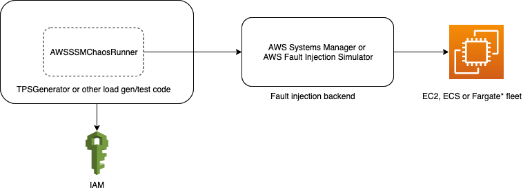

[](https://travis-ci.org/amzn/awsssmchaosrunner)
[](https://maven-badges.herokuapp.com/maven-central/software.amazon.awsssmchaosrunner/awsssmchaosrunner)
[](http://www.javadoc.io/doc/software.amazon.awsssmchaosrunner/awsssmchaosrunner)

## AWSSSMChaosRunner
AWSSSMChaosRunner is a library which simplifies failure injection testing for EC2. It uses the [AWS Systems Manager SendCommand](https://docs.aws.amazon.com/systems-manager/latest/APIReference/API_SendCommand.html) for failure injection.



### Usage
1. **Setup permissions for calling SSM from tests package**

    This can be done in many different ways. The approach described here generates temporary credentials for AWS SSM on each run of the tests. To enable this the following are needed
    
    * An IAM role with the following permissions.  
        ```json
        {
            "Version": "2012-10-17",
            "Statement": [
                {
                    "Action": [
                        "sts:AssumeRole",
                        "ssm:CancelCommand",
                        "ssm:CreateDocument",
                        "ssm:DeleteDocument",
                        "ssm:DescribeDocument",
                        "ssm:DescribeInstanceInformation",
                        "ssm:DescribeDocumentParameters",
                        "ssm:DescribeInstanceProperties",
                        "ssm:GetDocument",
                        "ssm:ListTagsForResource",
                        "ssm:ListDocuments",
                        "ssm:ListDocumentVersions",
                        "ssm:SendCommand"
                    ],
                    "Resource": [
                        "*"
                    ],
                    "Effect": "Allow"
                },
                {
                    "Action": [
                        "ec2:DescribeInstances",
                        "iam:PassRole",
                        "iam:ListRoles"
                    ],
                    "Resource": [
                        "*"
                    ],
                    "Effect": "Allow"
                },
                {
                    "Action": [
                        "ssm:StopAutomationExecution",
                        "ssm:StartAutomationExecution",
                        "ssm:DescribeAutomationExecutions",
                        "ssm:GetAutomationExecution"
                    ],
                    "Resource": [
                        "*"
                    ],
                    "Effect": "Allow"
                }
            ]
        }
        ```
    * An IAM user which can assume the above role.

2. **Add `AWSSSMChaosRunner` maven dependency to your tests package** 
    ```
    <dependency>
      <groupId>software.amazon.awsssmchaosrunner</groupId>
      <artifactId>awsssmchaosrunner</artifactId>
      <version>1.0.0</version>
    </dependency> 
    ```

1. **Initialise the SSM Client**
    ```kotlin
    @Bean
    open fun awsSecurityTokenService(
       credentialsProvider: AWSCredentialsProvider, 
       awsRegion: String
       ): AWSSecurityTokenService {
        return AWSSecurityTokenServiceClientBuilder.standard()
            .withCredentials(credentialsProvider)
            .withRegion(awsRegion)
            .build()
    }
    
    @Bean
    open fun awsSimpleSystemsManagement(
       securityTokenService: AWSSecurityTokenService,
       awsAccountId: String,
       chaosRunnerRoleName: String
       ): AWSSimpleSystemsManagement {
        val chaosRunnerRoleArn = "arn:aws:iam::$awsAccountId:role/$chaosRunnerRoleName"
        val credentialsProvider = STSAssumeRoleSessionCredentialsProvider
            .Builder(chaosRunnerRoleArn, "ChaosRunnerSession")
            .withStsClient(securityTokenService).build()
    
        return AWSSimpleSystemsManagementClientBuilder.standard()
            .withCredentials(credentialsProvider)
            .build()
    }
    ```
 
1. **Start the fault injection attack before starting the test and stop it after the test**
    ```kotlin
    import software.amazon.awsssmchaosrunner.attacks.SSMAttack
    import software.amazon.awsssmchaosrunner.attacks.SSMAttack.Companion.getAttack
    ...

    @Before
    override fun initialise(args: Array<String>) {
        if (shouldExecuteChaosRunner()) {
            ssm = applicationContext.getBean(AWSSimpleSystemsManagement::class.java)
            ssmAttack = getAttack(ssm, attackConfiguration)
            command = ssmAttack.start()
        }
    }
    
    @After
    override fun destroy() {
        ssmAttack.stop(command)
    }
    ```
1. **Run the test**

## FAQs

* **What about [Chaos-SSM-Documents](https://github.com/adhorn/chaos-ssm-documents) (github repo) ?**
    
    The idea for AWSSSMChaosRunner came from Chaos-SSM-Documents (and from [medium post](https://medium.com/@adhorn/injecting-chaos-to-amazon-ec2-using-amazon-system-manager-ca95ee7878f5)).

* **Why use AWS SSM ?**
    
    In most cases EC2 fleets are already using the SSM Agent for OS patching, this library leverages this existing agent and reduces
     setup work needed for fault injection.
     
* **What failure injections are available ?**
    
    * [NetworkInterfaceLatency](./src/main/kotlin/com/amazon/awsssmchaosrunner/attacks/NetworkInterfaceLatencyAttack.kt) - Adds latency to all inbound/outbound calls to 
    a given network interface.
    * [DependencyLatency](./src/main/kotlin/com/amazon/awsssmchaosrunner/attacks/DependencyLatencyAttack.kt) - Adds latency to inbound/outbound calls to a given 
    external dependency.
    * [MemoryHog](./src/main/kotlin/com/amazon/awsssmchaosrunner/attacks/MemoryHogAttack.kt) - Hogs virtual memory on the fleet.
    * [CPUHog](./src/main/kotlin/com/amazon/awsssmchaosrunner/attacks/CPUHogAttack.kt) - Hogs CPU on the fleet.
    * [DiskHog](./src/main/kotlin/com/amazon/awsssmchaosrunner/attacks/DiskHogAttack.kt) - Hogs disk space on the fleet.
    * [DependencyPacketLossAttack](./src/main/kotlin/com/amazon/awsssmchaosrunner/attacks/DependencyPacketLossAttack.kt) - Drops packets on inbound/outbound calls to a given external dependency.
    
* **What about other failure injections ?**

    You're welcome to send pull requests for other failure injections.
    
* **How is the failure injection rolled back ? / What if AWS SSM fails to stop the failure injection ?**

    SSM is not actually used to stop/roll back the failure injection. The failure injection scripts first schedule the failure rollback 
    (with [at command](https://pubs.opengroup.org/onlinepubs/9699919799/utilities/at.html)) and then start the actual failure injection. This ensures that, barring special cases, the failure injection will be rolled back at a specified time in the future.

* **What languages does AWSSSMChaosRunner support ?**

    AWSSSMChaosRunner can be used as a dependency from Kotlin, Java or Scala.